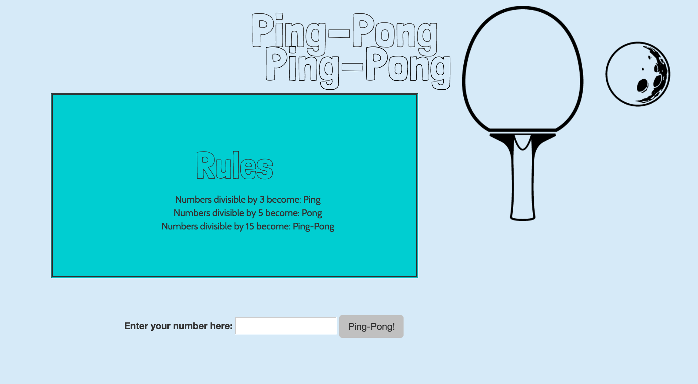

# _Ping Pong_

#### _Creating Friday Project for Loops and Arrays for Epicodus, 8/19/2016_

#### By _**Megan Kaluza**_

## Description

_Objectives:_

* _JavaScript business logic and user interface logic are separate._

* _Variable names are descriptive and use lower camel case (e.g. myVariableExample)._

* _Code has proper indentation and spacing._

* _Project is in a presentable, portfolio-quality state._

## Ping Pong Speculations
  _Create an array._
* _Input Example: []_
* _Output Example: [1,2,3,4,5..]_

_Create the array to be divisible._
* _Input Example: 3, 5, 15_
* _Output Example: True_

_Create a string of words._
* _Input Example: ""_
* _Output Example: "Ping, Pong, and Ping-Pong"_

_Join the array and string together._
* _Input Example: .join or .push_
* _Output Example: [1, 2, Ping, 4, Pong, Ping, 7, 8, Ping, Pong, 11, Ping, 13, 14, Ping-Pong_

## Setup/Installation Requirements

* _Clone this repository_
    _To clone using Git, use the following terminal command:_
    _https://github.com/megankaluza/ping-pong.git_
* _Open in text editor of your choice_

## Known Bugs

_No known bugs at this time._

## Support and contact details

_megan.kaluza@gmail.com_

## Technologies Used

_HTML_
_CSS_
_Bootstrap_
_Google Fonts_
_jQuery_
_JavaScript_

### License

Copyright (c) 2016 **_Megan Kaluza_**

This software is licensed under the MIT license.

Permission is hereby granted, free of charge, to any person obtaining a copy of this software and associated documentation files (the "Software"), to deal in the Software without restriction, including without limitation the rights to use, copy, modify, merge, publish, distribute, sublicense, and/or sell copies of the Software, and to permit persons to whom the Software is furnished to do so, subject to the following conditions:

The above copyright notice and this permission notice shall be included in all copies or substantial portions of the Software.

THE SOFTWARE IS PROVIDED "AS IS", WITHOUT WARRANTY OF ANY KIND, EXPRESS OR IMPLIED, INCLUDING BUT NOT LIMITED TO THE WARRANTIES OF MERCHANTABILITY, FITNESS FOR A PARTICULAR PURPOSE AND NONINFRINGEMENT. IN NO EVENT SHALL THE AUTHORS OR COPYRIGHT HOLDERS BE LIABLE FOR ANY CLAIM, DAMAGES OR OTHER LIABILITY, WHETHER IN AN ACTION OF CONTRACT, TORT OR OTHERWISE, ARISING FROM, OUT OF OR IN CONNECTION WITH THE SOFTWARE OR THE USE OR OTHER DEALINGS IN THE SOFTWARE.
